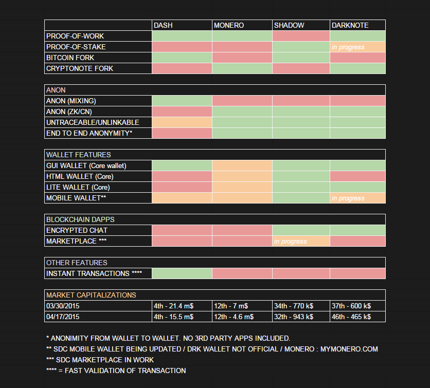

# About Shadow
<center><div class="video-container"><iframe width="854" height="480" src="https://www.youtube.com/embed/i-xnh7NFCA8" frameborder="0" allowfullscreen></iframe><div></center>

## History
Born on July 19, 2014, Shadow quickly distinguished itself as an innovative and unique open source project with a mission to create the first truly anonymous and decentralized cryptocurrency built with Bitcoin’s code. 
At the time, most cryptocurrencies had traits analogous to traditional bank accounts with transactional protocols similar to credit cards. 
The anonymity of cash-like system had yet to be realized within the cryptocurrency space. The Shadow Project development team tasked themselves to create just that.
Inspired by the Cypherpunk anonymity movement, the Shadow Project developers began fusing several online technologies and services while simultaneously integrating security improvements based on zero knowledge cryptography. 
After its first birthday, Shadow had evolved from a simple idea into one of the most advanced cryptocurrency projects to date. 
ShadowSend development has created near-instant, untraceable/unlinkable and trustless transactions utilizing non-interactive zero knowledge proofs, dual-key stealth addresses, and ring signatures. 
Shadow will soon offer a complete privacy platform which aims to establish an anonymous economy, delivering total financial freedom and privacy to all.

# Demos


## Basic flowchart

<pre class="mermaid">
%% Subgraph example
graph TB
     subgraph Block 1
     a1-->a2
     end
     subgraph Block 2
     b1-->b2
     end
     subgraph Block 3
     c1-->c2
     end
     c1-->a2
</pre>

## Mission Statement

Due to their superiority over traditional methods of exchange, virtual currencies are quickly becoming  very popular. 
Prior to Bitcoin, the largest problem for these virtual currencies was the prevention of double spending attacks. 
In short, double spending is the malicious act of executing multiple transactions using the same units of currency (the equivalent of counterfeiting paper money). 
Bitcoin was able to solve this major issue by integrating a public ledger of all previous transactions known as a block chain. 
Each member of Bitcoin’s network has the ability to analyze every transaction ever executed, allowing them to see if coins had been previously spent before accepting any new transactions. 
Unfortunately, as one may be able to easily deduce, a block chain such as Bitcoin’s does not allow for native anonymity or privacy. 
The public nature of a block chain allows anyone to observe the entire transaction history and holdings of every participant.

On December 10, 1948, the General Assembly of the United Nations adopted and proclaimed the Universal Declaration of Human Rights. Article 12 states, “No one shall be subjected to arbitrary interference with his privacy, family, home or correspondence, nor to attacks upon his honour and reputation. Everyone has the right to the protection of the law against such interference or attacks” [ link ]. Nearly 67 years later, we believe this declaration to be more important than ever. To help protect this most basic right to privacy, The Shadow Project is building an encrypted, digital ecosystem. Cryptographic innovations will catalyze the evolution of communication, commerce, and currency. Shadow’s mission is to remain at the forefront of this evolution with it’s decentralized privacy platform, made available to all operating systems.

## Shadow next to other cryptocurrencies

<span class="shadow-table"></span>

|                      |   SHADOW   |   MONERO   |    DASH    |  DARKNOTE  |
| -------------------- | ---------- | -----------| ---------- | ---------- |
| **Proof-of-Work**    |    false    |    true    |    true    |    true    |    
| **Proof-of-Stake**   |    true    |    false    |    false    |    progress    |
| **Bitcoin Based**    |    true    |    false    |    true    |    false    |
| **CryptoNote Based** |    false    |    true    |    false    |    true    |

### Privacy Features 

<span class="shadow-table"></span>

|                      |   SHADOW   |   MONERO   |    DASH    |  DARKNOTE  |
| -------------------- | ---------- | -----------| ---------- | ---------- |
| **Mixing**    |    false    |    false    |    true    |    false    |
| **Stealth Addresses**   |    true    |    true    |    false    |    true    |
| **Ring Signatures**   |    true    |    true    |    false    |    true    |
| **Zero Knowledge**   |    true    |    false    |    false    |    false    |
| **Untraceable**    |    true    |    true    |    undefined    |    true    |
| **Unlinkable**    |    true    |    true    |    false    |    true    |
| **End to end Anon** |    true    |    true    |    false    |    true    |

### Wallet Features -Core-

<span class="shadow-table"></span>

|                      |   SHADOW   |   MONERO   |    DASH    |  DARKNOTE  |
| -------------------- | ---------- | -----------| ---------- | ---------- |
| **GUI Wallet**    |    true    |    false    |    true    |    true    |    
| **HTML Interface**   |    true    |    false    |    false    |    false    |
| **Lite Wallet**    |    true    |    false    |    false    |    true    |
| **HD Wallet**    |    true    |    false    |    false    |    false    |
| **Multisignatures** |    progress    |    false    |    false    |    false    |

- HD: Hierarchical Deterministic

### Blockchain Decentralized Apps

<span class="shadow-table"></span>

|                      |   SHADOW   |   MONERO   |    DASH    |  DARKNOTE  |
| -------------------- | ---------- | -----------| ---------- | ---------- |
| **Encrypted Chat**    |    true    |    false    |    false    |    true    |    
| **MarketPlace**   |    progress    |    false    |    false    |    false    |

### Other Features

<span class="shadow-table"></span>

|                      |   SHADOW   |   MONERO   |    DASH    |  DARKNOTE  |
| -------------------- | ---------- | -----------| ---------- | ---------- |
| **Web Wallet**    |    false    |    true    |    false    |    false    |    
| **Fast Transactions**   |    false    |    false    |    true    |    false    |
| **Incentive Nodes**   |    false    |    false    |    true    |    false    |



# Community

Shadow has an awesome community, ranging from privacy activists to technical and financial experts. 
The biggest part of the community resides in #general on Slack, great times assured.

[Aboutshadow.com](http://aboutshadow.com) is dedicated to help Shadow’s community develop in a sustainable way. The website is registered and managed by community members, with the input of Shadow developers. Aboutshadow.com is not a foundation. Foundations imply centralization or a controlling body. All Shadow holders are equal and all have a say in the direction the project is heading. Just like nobody owns the email technology, nobody owns the Shadow network. As such, aboutshadow.com does not speak with authority in the name of the Shadow project.

## Social Media

Below you will find a list of places where you can find other Shadow users, community members and news.

- IRC: freenode.net #shadowcash
- Blog: [blog.shadowproject.io](http://www.blog.shadowproject.io)
- Forum: [talk.shadowproject.io](http://www.talk.shadowproject.io)
- Slack: [shadowproject.herokuapp.com](http://shadowproject.herokuapp.com/)
- Reddit: [reddit.com/r/ShadowCash](https://www.reddit.com/r/ShadowCash)
- Twitter: [twitter.com/allaboutshadow](http://www.twitter.com/allaboutshadow)

# ShadowCash

## Specification

Specification | Value
--- | ---
Block Time | **60 seconds**
Difficulty Re-target | **every block**
Nominal Stake Interest | **2% annually**
Min Stake Age | **8 hours** (no max age)
P2P Port | 51737
RPC Port | 51736

### Transactions

| Specification   | Value          |
| --------------- | -------------- |
| Min Fee         | **0.0001 SDC** |
| Confirmations   | **10**         |
| Maturity        | **500**        |

## Accept

To get started with accepting ShadowCash is easy, simply download the latest Shadow client and you are ready to go. There are no third party payment processors or middlemen and more importantly the transactions and funds appear in your account in seconds.

## Exchanges

Currently, you can only buy ShadowCash (SDC) once you have Bitcoin (BTC), then you can trade BTC for SDC on premium crypto-to-crypto exchanges.

ShadowCash is available at these exchanges:

- [BITTREX](https://bittrex.com/Market/Index?MarketName=BTC-SDC)
- [POLONIEX](https://poloniex.com/exchange#btc_sdc)

You can also pay with ShadowCash (SDC) anywhere Bitcoin (BTC) is accepted instantly with:

- [SHAPESHIFT](https://shapeshift.io/)
- [COINGATEWAY](https://coingateway.net/)

## Mining

### Proof of Work (PoW) - Complete
Specification | Value
--- | ---
Algo | Scrypt
Max Height | 31000 (after this network will not accept PoW blocks)
SDC Circulation |  ~6,400,000 SDC 
Length | two weeks of PoW

### Proof of Stake (PoS) - Ongoing
Specification | Value
--- | ---
Algo | Sha256 (formerly Scrypt)
Nominal Stake Interest | 2% annually

### Multipool
PoW mining has ended, but you can still use your mining rigs to earn ShadowCash by using the [SDC Multipool](https://www.shadowpool.info/). Point your rigs and enter your SDC payout address to begin!

# ShadowCore

## Introduction

ShadowCore is a decentralized anonymous communication, commerce and currency platform available for all desktop and mobile operating systems. Transactions are lightning fast, cannot be frozen and cannot be traced when using ShadowSend. Users earn 2% interest on wealth per annum for securing the network through PoS.

## HTML cryptobrowser

ShadowCore is an HTML Cryptobrowser and a secure platform through which the cryptocurrency, ShadowCash, can be transferred. One of the significant advantages of ShadowCore is its deep integration with the rest of Shadow's features as well as offering native TOR support for IP obfuscation.

## Hierarchical Deterministic (HD)

ShadowCore supports the [Hierarchical Deterministic](https://bitcoin.org/en/glossary/hd-protocol) (HD) key creation and transfer protocol ([BIP32](https://github.com/bitcoin/bips/blob/master/bip-0032.mediawiki)), allowing users to create [child keys](https://bitcoin.org/en/glossary/child-key) from [parent keys](https://bitcoin.org/en/glossary/parent-key) in a hierarchy. 

To create a better user experience ShadowCore implemented [BIP39](https://github.com/bitcoin/bips/blob/master/bip-0039.mediawiki), allowing users to create a wallet based on a mnenomic sentence consisting of 24 words with the ability to secure that with a password. 

#### Synonyms

- HD protocol
- HD wallet

### Links

- [HD Protocol](https://bitcoin.org/en/developer-guide#term-hd-protocol) — Bitcoin.org Developer Guide
- [BIP32: hierarchical deterministic wallets](https://github.com/bitcoin/bips/blob/master/bip-0032.mediawiki) — Bitcoin Improvement Proposals
- [Deterministic wallet](https://en.bitcoin.it/wiki/Deterministic_Wallet) — Bitcoin Wiki
 
## Source code

ShadowCash source code is all open-source and available at our [GitHub repository](https://github.com/SDCDev/shadowcoin)

## Download

### Desktop Wallet
- Latest [Windows](http://shadow.cash/downloads/shadow_1.3.3.3_win32.zip) wallet download
- Latest [Linux](http://shadow.cash/downloads/shadow_1.3.3.3_linux64_static.zip) wallet download
- Latest [OSX](http://shadow.cash/downloads/shadow_1.3.3.3_macosx.dmg) wallet download

### Mobile Wallet
- Latest Android wallet download - being upgraded!
- Latest iOS wallet download - being upgraded!

### Bootstrap & Useful Paths

> Windows

```
%appdata%\ShadowCoin
```

> OSX

```
~/Library/Application Support/ShadowCoin/
```

> Linux

```
~/.shadowcoin/
```

So you may be wondering what is "bootstrap" and what does it do? when you load the Shadow Wallet for the first time it connects to the ShadowCore P2P network and starts a process known as "syncing". The purpose of this is to create a full copy of the ShadowCash blockchain on the local hardware. This is very useful if for example you are: 

1. looking to help further strengthen the network by providing a full peer 
2. have ShadowCash (SDC) and wish to participate in staking or 
3. plan to run services on the Shadow network and require a full node.

If neither of the above apply you can set the Shadow wallet to "thinmode" which provides lightening fast synchronization to the ShadowCore P2P network.
If you decide that a fullnode (default) is for you then the full sync can take a little while; if you wish to speed this up you can bootstrap the process which will get your wallet up and running much quicker than the default method.

1. Close the Shadow Wallet and **download the latest Bootstrap** file from: [github.com/ShadowProject/bootstrap/](https://github.com/ShadowProject/bootstrap/)
2. Unzip the ```bootstrap.dat.zip``` file
3. Place the ```bootstrap.dat``` file in one of the below locations depending on the OS
4. Start the ShadowCash Wallet again (The client might be unresponsive but don't be alarmed - it's just loading all the blockchain data)

# Installing and running a client

## Linux
```
Update and Install dependencies:
```
>sudo apt-get update && apt-get upgrade
>sudo apt-get install git build-essential libssl-dev libdb-dev libdb++-dev libboost-all-dev libqrencode-dev

```
 Download the source code and compile shadowcoind
```
>git clone https://github.com/ShadowProject/shadow
>cd shadowcoin/src
>make -f makefile.unix
>strip shadowcoind

```
Run the daemon
```
>shadowcoind -daemon

```
 On the inital start-up shadowcoind will return an error because it cannot find the configuration file shadowcoin.conf
```
>nano ~/.shadowcoin/shadowcoin.conf


``` 
Add the following to your config file, changing the username and password to something secure:
```
> daemon=1
> rpcuser=<secure username>
> rpcpassword=<secure password>

```
You can copy the username and password provided in the earlier error message as the username and password is randomly generated and secure

 You can now start the shadowcoind daemon once more
```
>shadowcoind

```
List all commands for shadowcoind
```
>shadowcoind help


```
Stopping shadowcoind
```
>shadowcoind stop


The Linux Wallet comes in two variations:

- **QT Wallet**
  - Run the "shadow" executable from the linux download to run the Shadow QT Wallet
- **Daemon**
  - Run the "shadowcoind" executable from the linux download to start the Shadow daemon

### Shadowcoind from Source

If you wish you can also compile directly from source, below are the instructions to compile latest ShadowCore headless daemon based on Debian/Ubuntu. Please also refer to the build instructions for more detailed information.

## Shadowcoin-QT from Source
```
 Update and Install dependencies
```
>sudo apt-get update && apt-get upgrade
>sudo apt-get install git qt5-default qt5-qmake qtbase5-dev-tools qttools5-dev-tools build-essential libboost-dev libboost-system-dev libboost-filesystem-dev libboost-program-options-dev libboost-thread-dev libssl-dev libdb++-dev libminiupnpc-dev libqt5webkit5-dev

```
 Download the source code and compile shadow QT
```
>git clone https://github.com/ShadowProject/shadow
>cd shadow
>qmake
>make

```
Run the executable found within the shadowcoin folder with : 
```
>./shadow

<aside class="warning">
Warning : never use root to start the QT or daemon!
</aside>

## Mac Os

<aside class="notice">
The OSX QT Wallet comes pre-packaged with an Shadow executable, this is all you need to get your ShadowCash Wallet.
</aside>

## Windows

<aside class="notice">
The Windows QT Wallet comes pre-packaged with an Shadow executable, this is all you need to get your ShadowCash Wallet
</aside>

## ShadowLite

ShadowLite is the brand new component of the Shadow platform that brings lightning-fast syncing with the Shadow blockchain.

We've taken a completely different approach to wallet design based on the principles of the "Simplified Payment Verification" or “SPV” system outlined in section 8 of [Satoshi’s white paper](https://bitcoin.org/bitcoin.pdf). Instead of releasing a separate client, we’ve integrated optional lite functionality within the wallet. This allows for startup configuration to determine which mode you are running (thin or full).

ShadowLite mobile users have access to all existing functionality with a reduced bandwidth, storage and memory footprint.

Staking with the Lite wallet has been removed because staking is a reward for securing the network, Lite wallets do not do this.

### Instructions

```
For those of you who wish to enable the lite wallet, open your shadowcoin.conf configuration file with a text editor such as nano
```
>nano shadowcoin.conf

```
And add the following line
```
>thinmode=1


```
Alternatively, you can startup the client with the parameter -thinmode. (no graphical interface) 
```
>shadowcoind -thinmode

```
Or if you need a graphical interface.
```
> ./shadow -thinmode


There are two ways to start the wallet in Lite mode, both are described in this section.

The first method changes the ```shadowcoin.conf``` and will cause the wallet to permanently boot up in lite mode for as long as it is in the configuration file.

The second method will boot up an instance in Lite mode, not permanent. In case you always want to boot up in Lite mode we suggest the first method, but if need to make a transaction quickly without having to download the whole blockchain you can start the daemon with the ```-thinmode``` parameter.

# ShadowSend v2.0

## Introduction

ShadowSend’s anonymous cryptographic transaction protocol uses dual-key stealth addresses, traceable ring signatures layered with non­interactive zero knowledge proofs. 
Below you will find a presentation of the anonymous cryptographic transaction protocol which utilizes the above mentioned cryptographic principles. We explain how Shadow introduces a much higher level of privacy and anonymity to the network while still preserving the core principles of trustless decentralization, unforgeability and double­spend prevention.
We also presented performance data of our scheme including proof sizes, signature generation times and verification times in our white paper. 

A detailed diagram is available [here](http://i.imgur.com/2XTQhYF.jpg).

<central><iframe src="//www.slideshare.net/slideshow/embed_code/43827434" width="960" height="600" frameborder="0" marginwidth="0" marginheight="0" scrolling="no" style="border:1px solid #CCC; border-width:1px; margin-bottom:5px; max-width: 100%;" allowfullscreen></iframe></center>


## ShadowTokens (SDT)

In order to transact anonymously, we have introduced an anonymous token, which we will refer to as Shadow. Shadow can be minted, which destroys SDC (ShadowCash), and outputs a group of Shadow tokens totaling the same value (minus the transaction fee) of the destroyed SDC. 
Shadow Tokens take form of outputs on the ShadowCash blockchain and each one of them has its own private/public keypair. 
Shadow tokens are spendable only by providing a traceable ring signature to prove ownership of the token.

To increase the pool of outputs available for ring signatures, the SDC value is broken up into separate Shadow Tokens for each decimal place of the total value. The tokens are further broken up into values of 1, 3, 4 and 5. For example 1.7 SDC would become 3 tokens of values 1.0, 0.3 and 0.4.

## Dual-key stealth addresses ##
### Introduction and History ###
Dual-key Stealth addresses is one of the cornerstones of most anonymous cryptocurrencies currently available. The usage allows the recipient to remain anonymous, even after sharing his stealth address publicly.

Once the Stealth address has been revealed to the payer(s), it will be enable the payee to receive infinite unlinkable payments. **That means that each payment to a Stealth address computes a new unused normal address on which the funds will be received, any eavesdropper will be unable to link the two addresses.**

*No man will make a great leader who wants to do it all himself or get all the credit for doing it.* ~Andrew Carnegie

The original visionaries were the creators of Bytecoin, for whom we are thankful. Their technical documentation link has been included in the references *[1]*. The information they provide may not always apply to Shadow.
They are doing great work ByteCoin, surely worth to keep an eye on their work!

We would also like to take time to thank **Peter Todd**,he figured out how to implement stealth addresses into Bitcoin. You can find a link to his white paper in the references *[2]*.
He is a Bitcoin core developer and has done amazing work on Bitcoin and deserves the mention. 

Peter is also associated with DarkWallet , whose wiki provided lots of information on the working of Stealth addresses! Again, the link can be found in the references *[3]*.

The documentation at *sx* can also be very helpful to understand the concept of Stealth addresses, they also provide tools that can help you understand how it works. *[4]*.


### Address encoding
```cpp
//formatting function of stealth address
std::string CEKAStealthKey::ToStealthAddress() const
{
    // - return base58 encoded public stealth address
    
    std::vector<uint8_t> raw;
    raw = Params().Base58Prefix(CChainParams::STEALTH_ADDRESS);
    
    raw.push_back(nFlags); 
    raw.insert(raw.end(), pkScan.begin(), pkScan.end());
    raw.push_back(1); // number of spend pubkeys is 1
    raw.insert(raw.end(), pkSpend.begin(), pkSpend.end());
    raw.push_back(0); // number of signatures
    raw.push_back(0); // ?
    AppendChecksum(raw);
    
    return EncodeBase58(raw);
}; //extkey.cpp
```

Stealth addresses are generated in a different way than normal bitcoin addresses, but they have a similair structure.
A dual-key stealth address contains a lot more information than a normal Bitcoin address, because it requires the sender of a transaction to know the public scan key and the public spend key **which is not stored on the blockchain**.
All data required to perform such transaction is derivable from the Stealth address itself.
 
 
 
Just like a Bitcoin address, all data below is **Base-58** encoded, which also explains the familiar looking form.


Version | Options | Public Scan Key | # Public Spend Keys | Public Spend Key | # of signatures | Length of prefix | Prefix | Checksum
--- | --- |--- | --- |--- | --- |--- | --- | ---
0x28 | 0  | 33 bytes | 1 | 33 bytes | 0 | 0 | (not used) |  4 bytes

Parameter | value
--- | ---
**Version:**  | The hexadecimal representation (= 0x28) of '40' is used for the current release on the mainnet. The version field to keep track of updates of the protocol.
**Options:** | Field is always set to 0.
**Public scan key:** | This fields holds the public scan key, 33 bytes of data.
**Amount of public spend keys:** | The current protocol uses one public spend key for each Stealth address. The ability to specify multiple spend keys remains in the protocol because it is useful for the implementation of multi-signature addresses.
**Public spend keys:** | This fields holds the public spend key, 33 bytes of data.
**Amount of signatures:** | Field is always set to 0.
**Length of prefix:** | Field is always set to 0.
**Prefix:** | No prefix is used, since length is equal to zero. Other coins do make use of this field, more information can be found [here](https://wiki.unsystem.net/en/index.php/DarkWallet/Stealth#Computing_prefixes)
**Checksum:** | Contains the first 4 bytes of the SHA-256 hash provided by the operation: SHA256(SHA256(previous_data_concatenated)). The same checksum function used in Bitcoin addresses.

### Address computation and Transaction format
```

Alice (receiver)
publicSpendKeyAlice = public spend key
privateSpendKeyAlice = private spend key

publicScanKeyAlice = EC point, 33 bytes
privateScanKeyAlice = integer, 32 bytes

This is where it gets a bit more complicated, but no magic, just math!
G = Generator, the primitive root

To continue on, we have to understand how the public addresses are generated.
A public key is the private key multiplied by the primitive root G.

publicSpendKeyAlice = privateSpendKeyAlice * G
publicScanKeyAlice = privateScanKeyAlice * G

Bob (sender)
e = ephem secret key = ephem private key
publicEphemKey = e * G
Knows the public scan key of Alice (publicScanKeyAlice)!

Ephem is short for ephemeral, which means “short lived”. The ephem secret and public key are only used once and change on every stealth transaction. 

Bob now publishes the public ephem key (publicEphemKey) to the receiver Alice.

Because of the diffie-hellman algorithm ONLY THE RECEIVER AND SENDER can deduct the shared secret from the public ephem key.

SharedSecret = SHA256(ephem private key  * publicScanKeyAlice) (Formula for Sender)
SharedSecret = SHA256(privateScanKeyAlice * publicEphemKey) (Formula for Receiver)

Bob can now generate the public key to where it should send the coins.
publicKeyToPay = publicSpendKeyAlice + SharedSecret * G

Alice has two different ways of find out the the public key where the coins will go to.
When the wallet is encrypted:
publicKeyToPay = publicSpendKeyAlice + SharedSecret * G

When the wallet is decrypted:
publicKeyToPay = (privateSpendKeyAlice + SharedSecret)* G
```

If Alice would post a normal address publicly, anyone can explore the blockchain and see the transactions that belong to her. Stealth addresses solve this privacy issue. Alice can post her Stealth address publicly, and nobody will be any wiser of what transactions belong to her.

**It's extremely important to note that the payer derives a new NORMAL address from the Stealth address, to which the funds will be sent and in that process only allowing the payee to compute the corresponding private key.**

It uses a clever mathematical principle called the "Diffie-Hellman Key Exchange", which allows two entities to generate a shared secret based on their keypairs. 
An eavesdropper is unable to compute the shared secret, enabling private communication between the two. In the case an eavesdropper has full control over one of the keypairs (private and public key) then privacy is obviously broken. 

It is important to mention that we can not use the SharedSecret directly to generate the keypair, because that would also allow the sender control over the private key.
Instead a bit of mathematical "magic" (BIP32-style derivation) is applied: the SharedSecret is added to PrivateKeyAlice and we use that to generate the new keypair.

It uses a system of dual-keys to allow the wallet software to scan for stealth payments (using ScanKeyAlice) but not make any transactions, because that would require decryption of the wallet/stealth key. 
All transactions have to be made with the SpendKey, only available after decrypting your wallet.
The dual-key is more of a security practice, it allows a wallet (while encrypted) to scan for transactions. If it weren't implemented, the wallet would have to remain decrypted, rendering the protection provided by the encryption useless.

The payee has to know the ephem public key to compute the SharedSecret, but how is that data transferred from payer to payee? The ephem public key is embedded in the *stealth metadata*.

Any stealth transaction will require atleast 2 outputs, the stealth metadata and the actual spendable output.

Each spendable output in a stealth transaction will be preceded by the metadata for that output. Regular spends do not need metadata, because there is no use of ephem keys in normal transactions.

Format goes as following:

Output | Content
--- | ---
out #1 | **metadata for spend A**
out #2 | **stealth spend A**
out #3 | metadata for spend B
out #4 | stealth spend B
out #5 | *regular spend C*
out #6 | metadata for spend D
out #7 | stealth spend D


### References
[1] ByteCoin, *Technical Documentation*, 2015, Available at https://bytecoin.org/documentation/

[2] Peter Todd, *[Bitcoin-development] Stealth Addresses*, 2014,  Available at  http://sourceforge.net/p/bitcoin/mailman/message/31813471/

[3] Dark Wallet, *Stealth*, 2015,  Available at https://wiki.unsystem.net/en/index.php/DarkWallet/Stealth

[4] Sx, *Stealth*, 2015,  Available at http://sx.dyne.org/stealth.html

## Ring signatures
<aside class="warning">Hardfork occurring on 19th of October 00:00 GMT to implement the new ring signature scheme into the main net.</aside>

The ring signatures are a crucial part to anonymize the sender of a transaction.

Ring signature consists of the public key of the token being spent, plus the public keys from 3 to 200 other tokens of the same value as the token being spent. The nature of ring signatures makes it impossible to discover member of the coins in the ring signature is being spent, and transactions are no longer traceable.

It is not possible to determine which tokens have been spent, so all tokens remain in the blockchain as spendable outputs available as members of ring signatures for other token spends.


http://www.texpaste.com/n/xaypn9ni

<aside class="notice">TO COMPLETE</aside>

### Double Spend Prevention

The ring signature tags (keyImage) of the spent Shadow tokens are embedded in the blockchain to prevent double spends. Each tag is unique to the Shadow token, regardless of the other members of the ring signature.

When a new transaction contains a keyImage that has already been used, and thus is present in the blockchain, the new transaction will be rejected by the network.

## Spending Shadow tokens

There are two ways in which Shadow tokens can be spent: they can be sent as Shadow tokens or redeemed as SDC.

1. When sent as Shadow tokens, new tokens are minted for the recipient to the value of the input Shadow minus the transaction fee.
2. When redeemed as SDC, new SDC is created to the value of the input Shadow minus the transaction fee.

In both cases the input tokens become unspendable. The transaction fee for spending Shadow tokens is 100x greater than the fee for standard transactions. This is to cover the cost of the extra activity required by the network to transmit, verify and store shadow transactions, which are larger and require more processing than standard transactions.

In order to spend Shadow, we use ring signatures to sign the transaction. Our scheme consists of three functions, ```generateRingSignature```, ```generateKeyImage```, ```verifyRingSignature```.

For efficiency’s sake, when spending Shadow, we get a list of all anonymous outputs in the system, then we remove coins that don't have enough same value outputs in the system, then we choose the smallest coin or least number of smallest coins that can cover the amount + transaction fee.

Each Shadow coin has its own private key, so when spending Shadow, each coin or anonymous input, will need to have its own ring signature generated, and will then have to be verified.

## White paper

Our white paper on ShadowSend 2 can be found [here](http://shadow.cash/downloads/shadowcash-anon.pdf).


# ShadowChat

Communication is an essential component of doing business. Modern technology gives us cheap, reliable and effortless methods to communicate with others regardless of physical distance.

However, this technology does little to safeguard the content of our messages from the scrutiny of interested observers. We live in an age of constant and ubiquitous surveillance, where it becomes more difficult by the day to retain our privacy. Privacy is paramount when conducting business, the consequences of invasions of privacy can be devastating to both businesses and individuals, whether the attacker is a rival firm, a malicious individual or an overbearing government.

## Introduction

ShadowCash has implemented a P2P (peer-to-peer) Instant Messaging system utilizing  state-of-the-art encryption technology to keep your communications private. All messages are encrypted by the proven **AES-256-CBC algorithm**, and distributed between nodes in such a way as to prevent the recipients of messages from being inferred by assailants utilizing  sophisticated traffic analysis, even if the assailants can view the entire network and/or run nodes of the network.

To eliminate the risk and hassle of sharing passwords, we utilize the proven and trusted method of **Elliptic Curve Diffie-Hellman (ECDH) key exchange**.
The Elliptic Curve Digital Signature Algorithm (ECDSA) is used to give you confidence that the messages you received came from the original recipient and remained untouched in propagation.
Messages are distributed over the preexisting ShadowCoin p2p network, and a copy of each encrypted message is stored on each node for a period of 48 hours.

## Key Sharing

The Elliptic Curve Diffie-Hellman (ECDH) key exchange method allows a secret key for encryption to be shared between the sender and recipient using the data embedded in the message along with the private keys of ShadowCash addresses held by the sender and recipient.

This allows for distributing messages, of whom nobody knows the recipient of.

In order to send an encrypted message, you must possess the public key of the intended recipient. The public keys embedded in the ShadowCash transaction blockchain when any amount is spent. If you are sending to an address that has not spent a transaction in the blockchain, the public key to that address must be provided manually.

ShadowCash uses curve secp256k1 for all elliptic curve functions. This is the same curve used by bitcoin along with the vast majority of altcoins. With such widespread use underpinning systems of immense value it is extremely unlikely that curve secp256k1 is not secure.

Messages are signed by the keys they were sent with, this allows you to be confident of the origin of the messages you receive and also allows the public key of the sender to be extracted from the message, providing you all the information needed to send a reply.

## Encryption

**Detailed Procedure**

- Get public key *K* from destination address
  - Find in database created from scanning for public keys in the blockchain and user additions.
- Generate 16 random bytes using a secure random number generator. Call them *IV*. Generate a new random EC key pair with private key called *r* and public key called *R*.
- Generate shared secret key *P* using public key *K* and private key *r*.
  - Elliptic Curve Diffie-Hellman
- Use the shared secret key *P* and calculate the SHA512 hash *H*.
  - ECDH_compute_key of OpenSSL
  - Call the first 32 bytes of *H key_e* and the last 32 bytes *key_m*.
- Calculate a 32 byte MAC with HMACSHA256, using *key_m* as salt and (timestamp + destination + cipher text).
  - Message authentication code used
  - By also checking time-stamp and destination, recipients can be certain that these fields have not been tampered with.
- Generate a compact signature from the message data and sender's address.
  - Only if not sending anonymously
  - Recipient can verify that the message came from the sender
  - Also allows the public key to be reconstructed (useful to reply)
- Include address and compact signature in the payload to be encrypted.
- Compress the plain-text message with lz4 if the message is larger than 128 bytes.
- Encrypt the payload data with AES-256-CBC, using *IV* as initialization vector, *key_e* as encryption key.

## Message Propagation

Encrypted Messages are duplicated on every participating node in the ShadowCash network – this prevents adversaries form uncovering the recipient of an encrypted message by using network traffic analysis.

The messages are stored on each node for a maximum period of 48 hours, after which the message is deleted. If the recipient is absent from the network for 48 hours or more the possibility exists that they may not receive messages sent to them. It is recommended to connect to the network each day in order to prevent such an occurrence.

Stored messages are grouped by time in divisions of 1 hour. The system operates on the grouped buckets of messages to save bandwidth.


## Decryption

For each incoming message a node will attempt to decode the message with every owned address contained in the nodes white-list of addresses to receive messages on.

To speed up the process and allow for any payload format to be used, the Message Authentication Code (MAC) is calculated for the generated shared secret key, if it does not match the MAC provided in the message, decryption will fail and the function ends.

**Detailed Procedure**

- Get *IV* and *R* from the message block
- Get the private key *k* of the recipient used to decrypt.
- Generate shared secret key *P* using with private key *k* and public key *R*.
  - Elliptic Curve Diffie-Hellman
- Use the shared secret key *P* to generate the SHA512 hash *H*.
  - Call the first 32 bytes of *H key_e* and the last 32 bytes *key_m*.
- Calculate MAC' with HMACSHA256, using *key_m* as salt and hash of (time-stamp + destination + cipher text).
- Compare MAC with MAC'.
  - Return if not equal, decryption will fail.
- Decrypt the encrypted payload with AES-256-CBC, using *IV* as initialization vector, *key_e* as decryption key.
- Decompress message portion with lz4 if message is larger than 128 bytes.
- If address and compact signature were included then verify the message
Address and compact signature are not included when message is sent anonymously strip the sender's public key and add it to the public key database.

## White paper

White paper: [http://www.shadow.cash/downloads/shadowcoin-p2p-em.pdf](http://www.shadow.cash/downloads/shadowcoin-p2p-em.pdf)


# ShadowMarket

## Introduction
## Roadmap
## Q&A
## Buy
## Sell
## Trade
## White paper

# ShadowGo

## Android
## iOS

# Other

## Backup & restore wallet
## Connecting to the network
## Wallet options
## Support

For support please visit one of the links below:

- Forum: [talk.shadowproject.io](https://talk.shadowproject.io/)
- IRC: freenode.net #shadowcash
- SLACK: [shadowproject.herokuapp.com](http://shadowproject.herokuapp.com/)

# Developers

## Setting up the build environment and building

Windows
OSX
Linux
Rasbperry Pi
Docker

## Installing and running a node

Windows
osx
linux
coreos/docker

## Setting up and running a node on digitalocean using coreos/docker

## Setting up and running a node on scaleway

## Testnet

There are 2 ways of starting the daemon in testnet mode.

### 1 editing the shadowcoin.conf
Find the path to the files. (Windows: %appdata%/ShadowCoin/)

Create or add to the shadowcoin.conf file the following:
testnet=1
addnode=vps1.shadow.cash
addnode=vps2.shadow.cash

The addnode will help with extra connections because there are not many people running full testnet nodes.

### 2 start executable with testnet parameter

Start the ShadowCoin executable with the "-testnet" flag.
Windows:
Open up a command prompt, change directory to the installation folder of Shadow and run the following command:
```shadow.exe -testnet```

## Blockchain / Blocks / Transactions
## Data structures
## Spending
## Simple Raw Transaction
## Complex Raw Transaction
## Signing
## Multisig

# JSON-RPC API Reference

## addmultisigaddress
```json
addmultisigaddress <nrequired> <'["key","key"]'> [account]
```

## addnode
```json
addnode <node> <add|remove|onetry>
```

## addredeemscript

```json
addredeemscript <redeemScript> [account]
```

## anoninfo

```json
anoninfo [recalculate]
```

## anonoutputs

```json
anonoutputs [systemTotals] [show_immature_outputs]
```

## backupwallet <destination>

```json
backupwallet <destination>
```

## checkwallet
Check wallet for integrity.

## clearwallettransactions 
Delete all transactions from wallet - reload with reloadanondata
Warning: Backup your wallet first!

## createrawtransaction

```json
createrawtransaction [{"txid":txid,"vout":n},...] {address:amount,...}
```

## decoderawtransaction

```json
decoderawtransaction <hex string>
```

## decodescript

```json
decodescript <hex string>
```

## dumpprivkey

```json
dumpprivkey <shadowcashaddress>
```

## dumpwallet

```json
dumpwallet <filename>
```

## encryptwallet

```json
encryptwallet <passphrase>
```

## estimateanonfee

```json
estimateanonfee <amount> <ring_size> [narration]
```

<amount> is a real and is rounded to the nearest 0.000001
Used to estimate the anon fee with a given amount and ring size.

## getaccount

```json
getaccount <shadowcoinaddress>
```

## getaccountaddress

```json
getaccountaddress <account>
```

## getaddednodeinfo

```json
getaddednodeinfo <dns> [node]
```

## getaddressesbyaccount

```json
getaddressesbyaccount <account>
```

## getbalance

```json
getbalance [account] [minconf=1]
```

## getbestblockhash

## getblock

```json
getblock <hash> [txinfo]
```

## getblockbynumber

```json
getblockbynumber <number> [txinfo]
```

## getblockcount

## getblockhash

```json
getblockhash <index>
```

## getblocktemplate [params]

```json
getblocktemplate [params]
```

## getcheckpoint

## getconnectioncount

## getdifficulty

## getinfo

## getmininginfo

## getnetworkinfo

## getnewaddress

```json
getnewaddress [account]
```

## getnewpubkey

```json
getnewpubkey [account]
```

## getnewstealthaddress

```json
getnewstealthaddress [label]
```

## getpeerinfo

## getrawmempool

## getrawtransaction

```json
getrawtransaction <txid> [verbose=0]
```

## getreceivedbyaccount

```json
getreceivedbyaccount <account> [minconf=1]
```

## getreceivedbyaddress

```json
getreceivedbyaddress <shadowcashaddress> [minconf=1]
```

## getstakinginfo

## getsubsidy

```json
getsubsidy [nTarget]
```

## gettransaction <txid>

```json
gettransaction <txid>
```

## getwork

```json
getwork [data]
```

## getworkex

```json
getworkex [data, coinbase]
```

## help

```json
help [command]
```

## importprivkey

```json
importprivkey <shadowcoinprivkey> [label]
```

## importstealthaddress

```json
importstealthaddress <scan_secret> <spend_secret> [label]
```

## importwallet

```json
importwallet <filename>
```

## keypoolrefill

```json
keypoolrefill [new-size]
```

## listaccounts
<aside class="warning">Deprecated.</aside>

## listaddressgroupings

Lists groups of addresses which have had their common ownership made public by common use as inputs or as the resulting change in past transactions

## listreceivedbyaccount

```json
listreceivedbyaccount [minconf=1] [includeempty=false]
```

## listreceivedbyaddress

```json
listreceivedbyaddress [minconf=1] [includeempty=false]
```

## listsinceblock

```json
listsinceblock [blockhash] [target-confirmations]
```

## liststealthaddresses

```json
liststealthaddresses [show_secrets=0]
```

List owned stealth addresses.

When used with show_secrets=1 it will return a list of all stealth addresses, the labels, the scan secrets and spend secrets.

## listtransactions

```json
listtransactions [account] [count=10] [from=0] [show_coinstake=1]
```

Returns up to [count] most recent transactions skipping the first [from] transactions for account [account].
If you want to proces Stealth transactions (SDT) then you want to use this function.

There a bit of a trick necessary to get the stealth transactions, easier explained in an example:
Stealth address = "smYmoN9xyenTSow9RP4ecf172sdKTeN9k4ZVCiUhFY6MTQRqSS2LRSZSZECwnZSb1a7EaCNc4aPrmrkexBXEs4qeJTZ6m9NjJBgnQE"
=> Account name = "ao smYmoN9xyenTSow9..."

When stealth addresses are generated their account name is "ao first_16_chars...", the 3 dots at the end are important!


## listunspent

```json
listunspent [minconf=1] [maxconf=9999999]
```

Returns array of unspent transaction outputs with between minconf and maxconf (inclusive) confirmations.
Optionally filtered to only include txouts paid to specified addresses.
Results are an array of Objects, each of which has:
{txid, vout, scriptPubKey, amount, confirmations}

## makekeypair

```json
makekeypair [prefix]
```

## move

```json
move <fromaccount> <toaccount> <amount> [minconf=1] [comment]
```

## nextorphan

```json
nextorphan [connecthash]
```

## reloadanondata 
Removes all wallet transactions, anon cache, and rebuilds everything from zero.

## repairwallet
Repair wallet if checkwallet reports any problem

## resendtx

## reservebalance

```json
reservebalance [<reserve> [amount]]
```

## rewindchain

```json
rewindchain <number>
```

## scanforalltxns
Scans for all transactions and overwrites prior history and does update.
```json
scanforalltxns [fromHeight]
```

## scanforstealthtxns
Scans for all Stealth transactions and overwrites prior history and does update.
```json
scanforstealthtxns [fromHeight]
```

## sendalert

```json
sendalert <message> <privatekey> <minver> <maxver> <priority> <id> [cancelupto]
```

## sendanontoanon

```json
sendanontoanon <stealth_address> <amount> <ring_size> [narration] [comment] [comment-to]
```

## sendanontosdc

```json
sendanontosdc <stealth_address> <amount> <ring_size> [narration] [comment] [comment-to]
```

## sendfrom 

```json
sendfrom <fromaccount> <toshadowcoinaddress> <amount> [minconf=1] [comment] [comment-to] [narration]
```

## sendmany

```json
sendmany <fromaccount> {address:amount,...} [minconf=1] [comment]
```

## sendrawtransaction

```json
sendrawtransaction <hex string>
```

## sendsdctoanon

```json
sendsdctoanon <stealth_address> <amount> [narration] [comment] [comment-to]
```

## sendtoaddress

```json
sendtoaddress <shadowcoinaddress> <amount> [comment] [comment-to] [narration]
```

## sendtostealthaddress

```json
sendtostealthaddress <stealth_address> <amount> [comment] [comment-to] [narration]
```

## setaccount

```json
setaccount <shadowcoinaddress> <account>
```

## setbestblockbyheight <height>

```json
setbestblockbyheight <height>
```

## settxfee

```json
settxfee <amount>
```

## signmessage

```json
signmessage <shadowcashaddress> <message>
```

## signrawtransaction

```json
signrawtransaction <hex string> [{"txid":txid,"vout":n,"scriptPubKey":hex},...] [<privatekey1>,...] [sighashtype="ALL"]
```

## smsgaddkey

```json
smsgaddkey <address> <pubkey>
```

## smsgbuckets [stats|dump]

```json
smsgbuckets [stats|dump]
```

Display some statistics.

## smsgdisable 

Disable secure messaging

## smsgenable 

Enable secure messaging

## smsggetpubkey

```json
smsggetpubkey <address>
```

Returns the public key for a given address.

```json
Example:
smsggetpubkey tFyq452LPtDotWat8PFwEV5oPoWDqagLNv
Output:
{
"result" : "Success.",
"address in wallet" : "tFyq452LPtDotWat8PFwEV5oPoWDqagLNv",
"compressed public key" : "26S8iEiv2754RskjkWqRZkbZ22iNRYPgK7sUPyRPueXni"
}
```

## smsginbox

```json
smsginbox [all|unread|clear]
```

Decrypt and display all received messages.
"all" will show all messages, "unread" will only show the unread messages.

<aside class="warning">Warning: clear will delete all messages.</aside>


```json
 Example:
smsginbox all

Output:
{
"message" : {
"received" : "2015-09-13 16:19:53 Romance",
"sent" : "2015-09-13 16:19:51 Romance",
"from" : "anon",
"to" : "tFyq452LPtDotWat8PFwEV5oPoWDqagLNv",
"text" : "ShadowCash is awesome"
},
"message" : {
"received" : "2015-09-13 16:18:36 Romance",
"sent" : "2015-09-13 16:18:35 Romance ",
"from" : "anon",
"to" : "tFyq452LPtDotWat8PFwEV5oPoWDqagLNv",
"text" : "This secure messagings is brilliant!"
},
"result" : "2 messages shown."
}
```

## smsglocalkeys

```json
smsglocalkeys [whitelist|all|wallet|recv <+/-> <address>|anon <+/-> <address>]
```

## smsgoptions

```json
smsgoptions [list|set <optname> <value>]
```

List and manage the secure message options.


```json
Example 1:
smsgoptions list

Output:
{
"option" : "newAddressRecv = true",
"option" : "newAddressAnon = true",
"result" : "Success."

Example 2:
smsgoptions set newAddressRecv false

Output:
{
"option" : "newAddressRecv = false",
"option" : "newAddressAnon = true",
"result" : "Success."
}
```

## smsgoutbox

```json
smsgoutbox [all|clear]
```

Decrypt and display all sent messages.
<aside class="warning">Warning: clear will delete all sent messages.</aside>

Will also show all messages sent with smsganonsend.

> Example:

```json
smsgoutbox

Output:
{
"message" : {
"sent" : "2015-09-13 16:19:51 Romance",
"from" : "anon",
"to" : "tFyq452LPtDotWat8PFwEV5oPoWDqagLNv",
"text" : "ShadowCash is awesome"
},
"message" : {
"sent" : "2015-09-13 16:18:35 Romance",
"from" : "anon",
"to" : "tFyq452LPtDotWat8PFwEV5oPoWDqagLNv",
"text" : "This secure messaging is brilliant!"
},
"result" : "2 sent messages shown."
}
```

## smsgscanbuckets

Force rescan of all messages in the bucket store.

## smsgscanchain 

Look for public keys in the block chain.

## smsgsend <addrFrom> <addrTo> <message>

```json
smsgsend <addrFrom> <addrTo> <message>
```

## smsgsendanon

```json
smsgsendanon <addrTo> <message>
```

Send and anonymous message to an address.

```json
smsgsendanon tFyq452LPtDotWat8PFwEV5oPoWDqagLNv "This secure messagings is brilliant!"

Output:
{
"result" : "Sent."
}
```

## stop

Stop the shadowcoin server

## submitblock

```json
submitblock <hex data> [optional-params-obj]
```

## thinforcestate

```json
thinforcestate <state>
```

## thinscanmerkleblocks

```json
thinscanmerkleblocks <height>
```

## txnreport

```json
txnreport [collate_amounts] [show_key_images]
```

## validateaddress

```json
validateaddress <shadowcashaddress>
```

## validatepubkey

```json
validatepubkey <shadowcashpubkey>
```

## verifymessage

```json
verifymessage <shadowcashaddress> <signature> <message>
```


# Contribute

Shadow is an Open Source project which is created almost entirely by volunteers. There are lots of ways you can get involved and help the project grow and improve. Here are some ways for you to get started.

## Code

Shadow is controlled by all Shadow users around the world. If you are a developer, you can use your super-powers to do good and contribute. [The Shadow project is hosted over on GitHub](https://github.com/ShadowProject/shadow). This is where developers work hard on the next version(s) of the software. To get involved with developing Shadow, check out our detailed contributing guidelines. We credit all contributors to the Shadow project in every major and minor release. We hold public development meetings and chat in our Slack team. We also maintain a public roadmap and dev blog to give you an idea of what's being worked on right now, and what's coming next. Are you someone who might be interested? Do not hesitate and contact us directly.

## Donate

We are a non-profit and Open Source software project and are trying to build a private economy. We appreciate all the help we can get in making this a reality. Both addresses are managed by Rynomster (lead developer). If applicable, please specify whether you want to remain anonymous. Many thanks to all our sponsors!
 
- Official **BTC donation** address: ```155cKQ5pk9kCQoXigxQapnLNyBK3hMrd2V```
- Official **SDC development** donation address: ```SdcdevXEaZaE9nDKjh6aH7kd3NcLX5rwAY```

## Report

If you think you've found a bug or a problem with Shadow, please let us know! First, search our issue tracker to search to see if someone has already reported the problem. If they haven't, click here to open a new issue, and fill out the template with as much information as possible. The more you can tell us about the problem and how it occurred, the more likely we are to fix it. Please check out our bug and bounty program for our guidelines and more details. 

Please do not report security vulnerabilities publicly. The details for responsible disclosure of security issues can be found in our bug and bounty program.

### Bugs & Bounty program

Official bug donation Address: ```SdcbugSrxsYSBzxB2cVfiAYdqwjftLBaF1```

According to Linus’ Law, “given enough eyeballs, all bugs are shallow”. That’s one of the reasons why Shadow’s source code is publicly available; but merely making the source code available doesn’t accomplish anything if people don’t read it!

For this reason, Shadow has a series of bug bounties. Similar to the bounties offered by Mozilla and Google, Shadow bug bounties provide an opportunity for people who find bugs to be compensated. Unlike those programs, however, Shadow’s bounties are not limited to security vulnerabilities.

Depending on the type of bug and when it is reported, different bounties will be awarded. Bounties are paid out in SDC, at the 3-day average of each to a fixed US Dollar value.

### Things that do not qualify under the bug bounty 

- Bugs found on third-party/community sites, software or services, which is not due to an improper configuration issue specific to us. Please submit any potential issues to the maintainers of that site or providers of that service.
- Vulnerabilities which are too broad or not documented properly (i.e. do not include a specific example relevant to a - Shadow-controlled site or application).
- Bugs or issues with a third-party site, software, or service that we use, which is not due to an improper configuration issue specific to us. Please submit any potential issues to the maintainers of that site or providers of that service.
- Bugs and errors found in software/code that is still undergoing alpha or beta testing.
- Usability issues
- Anything requiring social engineering
- DOS/DDOS attacks
- Missing HSTS (HttpOnly flags), Secure flag, Browser Cache vulnerabilities
- CSRF that doesn’t affect the victim
- Referrer leakage to pages an attacker cannot control.
- The presence of unnecessary files, e.g. for backups, when these files do not expose any sensitive information.
- Anything that is the result of an automated Nessus/PCI scans (too general)
- DNS issues (e.g. lack of an SPF record)
- SSL certificate issues
- Bugs that have received mainstream tech media or community attention before the date of your disclosure.

### Bug Bounties and Rewards

- **$1500** Deanonymize ShadowChat or ShadowSend (proof that a protocol is not anonymous)
- **$750** A flaw in the protocol that allows for theft or loss of funds
- **$500** A bug in the reference client that leads to consensus issues
- **$250** ~ 1 BTC A bug which causes data corruption or loss
- **$100** A bug which causes the application to crash
- **$50** Other non-harmless bugs
- **$10** ‘Harmless’ bugs, e.g. cosmetic errors

### How to report a bug

#### Security-related issues

Contact the developers privately by sending an e-mail to [bounties@shadow.cash](mailto:bounties@shadow.cash) with the details of the issue. Do not post the issue on github or anywhere else until the issue has been resolved.

#### Code issues

We would strongly prefer if you create a pull-request on Github in the proper repository with the necessary fix (along with your SDC address to claim the bounty). For more information, see this link.


----


# Kittens

## Get All Kittens

```ruby
require 'kittn'

api = Kittn::APIClient.authorize!('meowmeowmeow')
api.kittens.get
```

```python
import kittn

api = kittn.authorize('meowmeowmeow')
api.kittens.get()
```

```shell
curl "http://example.com/api/kittens"
  -H "Authorization: meowmeowmeow"
```


```json
The above command returns JSON structured like this:
[
  {
    "id": 1,
    "name": "Fluffums",
    "breed": "calico",
    "fluffiness": 6,
    "cuteness": 7
  },
  {
    "id": 2,
    "name": "Isis",
    "breed": "unknown",
    "fluffiness": 5,
    "cuteness": 10
  }
]
```

This endpoint retrieves all kittens.

### HTTP Request

`GET http://example.com/api/kittens`

### Query Parameters

Parameter | Default | Description
--------- | ------- | -----------
include_cats | false | If set to true, the result will also include cats.
available | true | If set to false, the result will include kittens that have already been adopted.

<aside class="success">
Remember — a happy kitten is an authenticated kitten!
</aside>

## Get a Specific Kitten

```ruby
require 'kittn'

api = Kittn::APIClient.authorize!('meowmeowmeow')
api.kittens.get(2)
```

```python
import kittn

api = kittn.authorize('meowmeowmeow')
api.kittens.get(2)
```

```shell
curl "http://example.com/api/kittens/2"
  -H "Authorization: meowmeowmeow"
```

> The above command returns JSON structured like this:

```json
{
  "id": 2,
  "name": "Isis",
  "breed": "unknown",
  "fluffiness": 5,
  "cuteness": 10
}
```

This endpoint retrieves a specific kitten.

<aside class="warning">If you're not using an administrator API key, note that some kittens will return 403 Forbidden if they are hidden for admins only.</aside>

### HTTP Request

`GET http://example.com/kittens/<ID>`

### URL Parameters

Parameter | Description
--------- | -----------
ID | The ID of the kitten to retrieve

